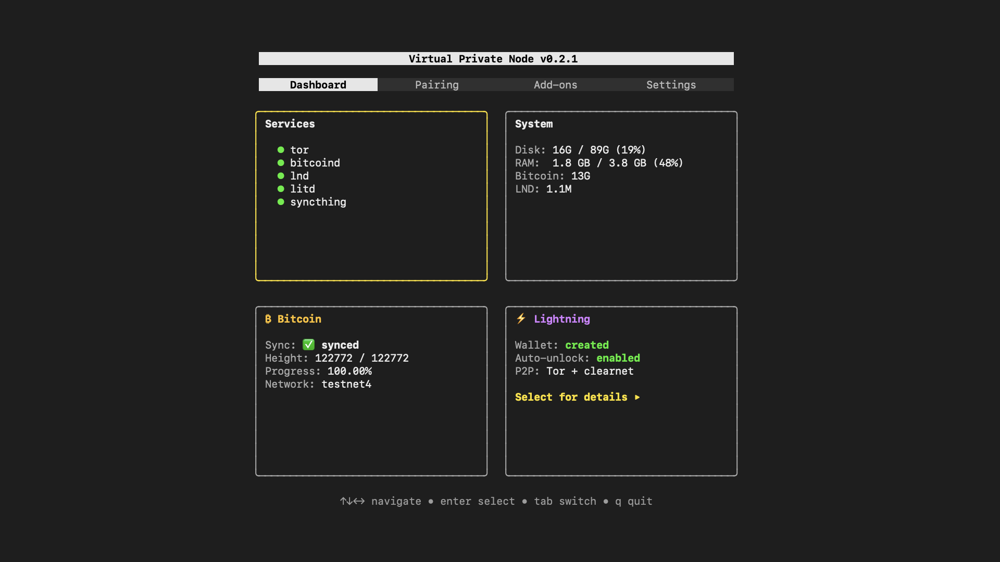

## Virtual Private Node

A one-command installer for a private Lightning node on Debian —
Bitcoin Core, LND, and Tor, configured and running in minutes.

After installation, manage your node with `bitcoin-cli`, `lncli`,
and `systemctl`. No wrappers, no abstractions. Your keys, your node.

### What it installs

- **Tor** — all connections routed through Tor
- **Bitcoin Core 29.3** — pruned (25 GB), Tor-routed, wallet disabled

### Additional software (from Dashboard and Add-ons)

- **LND 0.20.0-beta** — Lightning with Tor hidden services (from Dashboard)
- **Lightning Terminal v0.16.0-alpha** — browser UI for channel management (from Add-ons)
- **Syncthing** — automatic LND channel backup over Tor (from Add-ons)



### Requirements

- Fresh Debian 13+
- 2 (v)CPU, 4+ GB RAM, 90+ GB SSD
- [Mynymbox VPS with exact specs](https://client.mynymbox.io/store/custom/custom-vps-2-4-90-nl?aff=8)

### Quick Start

SSH into Debian 13+ as root and run:

```bash
apt update && apt install -y git curl
```
```bash
curl -sL https://raw.githubusercontent.com/ripsline/virtual-private-node/main/virtual-private-node.sh | bash
```

This creates a`ripsline` user, downloads the`rlvpn` binary, and
disables root SSH. Follow the on-screen instructions to SSH in as
`ripsline` — Bitcoin Core begins installing and syncing automatically.

For testnet4:

```bash
curl -sL https://raw.githubusercontent.com/ripsline/virtual-private-node/main/virtual-private-node.sh | bash -s -- --testnet4
```

### Dashboard

Every SSH login as`ripsline` opens a dashboard with four tabs:

- **Dashboard** — Services (with logs), System, Bitcoin, and Lightning cards
- **Pairing** — Zeus wallet connection with QR codes (Tor and clearnet)
- **Add-ons** — install Lightning Terminal and Syncthing
- **Settings** — self-update

Press`q` to drop to a shell:

```bash
bitcoin-cli getblockchaininfo
bitcoin-cli getpeerinfo

# After installing LND from Dashboard:
lncli getinfo
lncli walletbalance

# Services
sudo systemctl status bitcoind
sudo systemctl status lnd
sudo journalctl -u lnd -n 50 --no-pager
```

### Build from Source

```bash
apt update && apt install -y git wget sudo curl

cd /tmp
wget https://go.dev/dl/go1.26.0.linux-amd64.tar.gz
sudo rm -rf /usr/local/go
sudo tar -C /usr/local -xzf go1.26.0.linux-amd64.tar.gz
echo 'export PATH=$PATH:/usr/local/go/bin' >> ~/.profile
source ~/.profile

cd ~
git clone https://github.com/ripsline/virtual-private-node.git
cd virtual-private-node
go mod tidy
go build -o rlvpn ./cmd/
sudo install -m 755 ./rlvpn /usr/local/bin/rlvpn
curl -sL https://raw.githubusercontent.com/ripsline/virtual-private-node/main/virtual-private-node.sh | bash
```

The bootstrap script detects that`rlvpn` is already installed and
skips the download.

### Software Verification

All software is verified with GPG signatures and SHA256 checksums:

- **Bitcoin Core** — 5 trusted builder keys from
  [bitcoin-core/guix.sigs](https://github.com/bitcoin-core/guix.sigs).
  Requires 2 of 5 valid signatures. A bad signature (BADSIG) from any key is a hard stop.
- **LND** — Roasbeef's signing key verified against known fingerprint.
- **Lightning Terminal** — ViktorT-11's signing key from Ubuntu keyserver.

Verification failure is a hard stop.

After installation, review the verification log:

```bash
sudo cat /var/log/rlvpn-verification.log
```

For manual binary verification before installation, see
[Release Verification](docs/verifying.md).

### Connecting Zeus Wallet

#### Tor only (default)
1. Install LND from Dashboard, create wallet
2. Open Pairing tab → Zeus card
3. In Zeus: Advanced Set-Up → LND (REST)
4. Enter server address, REST port (8080), and macaroon from Pairing tab
5. Or scan QR code from Pairing tab

#### Clearnet + Tor (hybrid mode)
1. Install LND with hybrid P2P mode, or upgrade from Lightning details
2. Open Pairing tab → Zeus card
3. Both clearnet (IP:8080) and Tor connection details are shown
4. Scan the Clearnet QR
5. First clearnet connection: accept the certificate warning — the connection is encrypted

Note: Clearnet is faster. Tor is more private. Both use the same macaroon.

#### P2P Mode

During LND installation, choose between:

- Tor only — maximum privacy, all connections through Tor
- Hybrid (Tor + clearnet) — better routing, your server IP is published to the Lightning Network

You can upgrade from Tor-only to hybrid later from the Lightning
details view. This is a one-way change — once your IP is published
to the network gossip, it cannot be retracted.

### Syncthing Channel Backups

Syncthing automatically syncs your LND`channel.backup` file to
your local device over Tor. No cloud services. No trust. If your
VPS dies, recover your channels with your seed phrase and the
backup file.

For the full setup guide, see
[Syncthing Setup Guide](docs/syncthing.md).

### Security

- TUI runs as unprivileged user, sudo per-action (not root)
- All connections through Tor (SOCKS5 port 9050)
- IPv6 disabled to prevent Tor bypass
- Stream isolation (separate circuit per connection)
- UFW firewall: SSH only (+ 9735, 8080 for hybrid P2P)
- Fail2ban: SSH brute-force protection
- Root SSH disabled after bootstrap
- Services run as dedicated bitcoin system user
- GPG signature verification for all software
- Signing key hosted on independent keyserver with pinned fingerprint
- Bad signature detection — any BADSIG is a hard stop
- Unattended security upgrades with auto-reboot
- LND channel backup auto-synced via Syncthing over Tor
- Bitcoin Core wallet disabled (Lightning-only node)

### Architecture

```
User SSH → ripsline@VPS → rlvpn dashboard (non-root)
                             ↓
              sudo per-action → systemctl, bitcoin-cli, lncli
              press q → shell with bitcoin-cli, lncli wrappers

Services (systemd, run as bitcoin user):
  tor.service → SOCKS proxy, hidden services
  bitcoind.service   → pruned node, Tor-routed, wallet disabled
  lnd.service → Lightning (from Dashboard)
  litd.service       → Lightning Terminal (add-on)
  syncthing.service  → channel backup sync (add-on)
```

### Directory Layout

| Path | Contents |
| --- | --- |
| /etc/bitcoin/bitcoin.conf | Bitcoin Core configuration |
| /etc/lnd/lnd.conf | LND configuration |
| /etc/lit/lit.conf | Lightning Terminal configuration |
| /etc/syncthing/ | Syncthing configuration |
| /etc/rlvpn/config.json | Install state and credentials |
| /var/lib/bitcoin/ | Blockchain data |
| /var/lib/lnd/ | LND data and wallet |
| /var/lib/lit/ | Lightning Terminal data |
| /var/lib/syncthing/lnd-backup/ | Auto-synced channel.backup |
| /var/log/rlvpn-verification.log | Software verification audit log |

## License

Copyright (C) 2026 ripsline

This project is free software licensed under the
[GNU Affero General Public License v3.0](LICENSE).