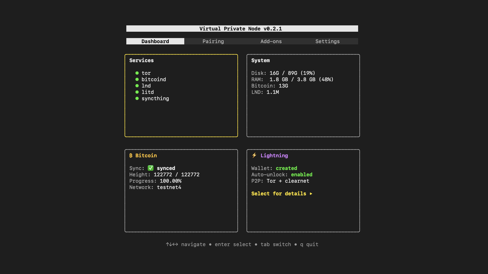

# Virtual Private Node

A one-command installer for a private Lightning node on Debian —
Bitcoin Core, LND, and Tor, configured and running in minutes.

After installation, manage your node with the beautiful terminal UI
or  `bitcoin-cli`, `lncli`, and `systemctl`. 
No wrappers, no abstractions. Your keys, your node.



## What gets installed

### Base (automatic)

- **Bitcoin Core** — pruned node, Tor-only P2P, GPG-verified with 5 independent signatures
- **Tor** — all traffic routed through Tor by default
- **UFW firewall** — deny all incoming except SSH
- **fail2ban** — brute force protection
- **Unattended upgrades** — automatic Debian security updates

### Optional (from the TUI)

- **LND** — Lightning Network daemon with Tor hidden services
- **Lightning Terminal** — browser-based channel management over Tor
- **Syncthing** — automatic LND channel backup to your local device
- **LndHub.go** — Lightning accounts

### Requirements

- Fresh Debian 13+
- 2 (v)CPU, 4+ GB RAM, 90+ GB SSD
- [Mynymbox VPS with exact specs](https://client.mynymbox.io/store/custom/custom-vps-2-4-90-nl?aff=8)

### Quick Start

SSH into Debian 13+ as root and run:

```bash
apt update && apt install -y git curl
```
```bash
curl -sL https://raw.githubusercontent.com/ripsline/virtual-private-node/main/virtual-private-node.sh | bash
```

This creates a `ripsline` user, downloads the `rlvpn` binary, and
disables root SSH. Follow the on-screen instructions to SSH in as 
`ripsline` — Bitcoin Core begins installing and syncing automatically.

For testnet4 (developers usually):

```bash
curl -sL https://raw.githubusercontent.com/ripsline/virtual-private-node/main/virtual-private-node.sh | bash -s -- --testnet4
```

### Dashboard

Every SSH login as `ripsline` opens a dashboard with four tabs:

- **Dashboard** — Services (with logs), System, Bitcoin, and Lightning cards
- **Pairing** — Zeus wallet connection with QR codes (Tor and clearnet)
- **Add-ons** — install Syncthing, LndHub, and Lightning Terminal
- **Settings** — update to new version

Press`q` to drop to a shell:

```bash
bitcoin-cli getblockchaininfo
bitcoin-cli getpeerinfo

# After installing LND from Dashboard:
lncli getinfo
lncli walletbalance

# Services
systemctl status bitcoind
systemctl status tor@default
systemctl status lnd
systemctl status litd
systemctl status lndhub
systemctl status syncthing
```

### Software Verification

All software is verified with GPG signatures and SHA256 checksums:

- **Bitcoin Core** — 5 trusted builder keys from
  [bitcoin-core/guix.sigs](https://github.com/bitcoin-core/guix.sigs).
  Requires 2 of 5 valid signatures. A bad signature (BADSIG) from any key is a hard stop.
- **LND** — Roasbeef's signing key verified against known fingerprint.
- **Lightning Terminal** — ViktorT-11's signing key from Ubuntu keyserver.
- **LndHub.go** — built from source at pinned release tag (v1.0.2).
  No prebuilt binary is used. The Go toolchain compiles directly from
  the [getAlby/lndhub.go](https://github.com/getAlby/lndhub.go) repository.

Verification failure is a hard stop.

After installation, review the log:

```bash
cat /var/log/rlvpn.log
```

For manual binary verification before installation, see
[Release Verification](docs/verifying.md).

### Build from Source

```bash
apt update && apt install -y git wget sudo curl

cd /tmp
wget https://go.dev/dl/go1.26.0.linux-amd64.tar.gz
sudo rm -rf /usr/local/go
sudo tar -C /usr/local -xzf go1.26.0.linux-amd64.tar.gz
echo 'export PATH=$PATH:/usr/local/go/bin' >> ~/.profile
source ~/.profile

cd ~
git clone https://github.com/ripsline/virtual-private-node.git
cd virtual-private-node
go mod tidy
go build -o rlvpn ./cmd/
sudo install -m 755 ./rlvpn /usr/local/bin/rlvpn
curl -sL https://raw.githubusercontent.com/ripsline/virtual-private-node/main/virtual-private-node.sh | bash
```

### Connecting Zeus Wallet

#### Tor only (default)
1. Install LND from Dashboard, create wallet
2. Open Pairing tab → Zeus card
3. In Zeus: Advanced Set-Up → LND (REST)
4. Enter server address, REST port (8080), and macaroon from Pairing tab
5. Or scan QR code from Pairing tab

#### Clearnet + Tor (hybrid mode)
1. Install LND with hybrid P2P mode, or upgrade from Lightning details
2. Open Pairing tab → Zeus card
3. Both clearnet (IP:8080) and Tor connection details are shown
4. Scan the Clearnet QR
5. First clearnet connection: accept the certificate warning — the connection is encrypted

Note: Clearnet is faster. Tor is more private. Both use the same macaroon.

#### P2P Mode

During LND installation, choose between:

- Tor only — maximum privacy, all connections through Tor
- Hybrid (Tor + clearnet) — better routing, your server IP is published to the Lightning Network

You can upgrade from Tor-only to hybrid later from the Lightning
details view. This is a one-way change — once your IP is published
to the network gossip, it cannot be retracted.

### LndHub — Lightning Accounts

LndHub.go provides separate Lightning wallet accounts backed by your
LND node. Create accounts for family, friends, or AI agents from the
Add-ons tab. Each account gets isolated credentials and connects via
Zeus or any LndHub-compatible wallet.

**How it works:**

1. Install LndHub from the Add-ons tab
2. Create accounts from the LndHub management screen
3. Share the login, password, and server address with the user
4. They connect Zeus: Advanced Set-Up → LndHub → enter credentials
5. Fund their account by paying an invoice they generate

**Privacy model:**

- Passwords are shown once at creation and never stored
- The admin cannot see user balances through the TUI
- Account deactivation records the balance for refund purposes
- LndHub uses a dedicated macaroon with minimal LND permissions
  (info:read, invoices:read/write, offchain:read/write)

**Built from source:**

LndHub.go is cloned from GitHub at a pinned release tag and compiled
on your server using the Go toolchain. No prebuilt binaries are downloaded.
PostgreSQL is installed as the database backend.

**Clearnet note:** Clearnet connections (hybrid P2P mode) are encrypted
via a TLS reverse proxy. Tor connections use HTTP through the encrypted
Tor tunnel. Both are secure in transit.

### Syncthing Channel Backups

Syncthing automatically syncs your LND `channel.backup` file to
your local device. No cloud services. No trust. If your Server dies,
recover your channels with your seed phrase and the backup file.

The sync connection is direct between your Node and your device
over an encrypted channel. Syncthing uses mutual TLS authentication
with device keys — only devices you explicitly approve can connect.
Discovery servers and relays are disabled.

**Setup summary:**

1. Install Syncthing on your device from [syncthing.net](https://syncthing.net)
2. Disable discovery, relays, and NAT traversal in local Syncthing settings
3. Pair your device from the Add-ons tab in the dashboard
4. Add the Node as a remote device in your local Syncthing
5. Accept the backup folder share and set it to Receive Only

Your `channel.backup` syncs automatically whenever both devices are
online. The Syncthing web UI on the Node is accessible over Tor for
advanced configuration.

For the full setup guide, see
[Syncthing Setup Guide](docs/syncthing.md).

### Security

- TUI runs as unprivileged user, sudo per-action (not root)
- All connections through Tor (SOCKS5 port 9050)
- IPv6 disabled to prevent Tor bypass
- Stream isolation (separate circuit per connection)
- UFW firewall: SSH only (+ 9735, 8080, 3000 for hybrid P2P, 22000 for Syncthing)
- Fail2ban: SSH brute-force protection
- Root SSH disabled after bootstrap
- Services run as dedicated bitcoin system user
- GPG signature verification for all software
- Signing key hosted on independent keyserver with pinned fingerprint
- Bad signature detection — any BADSIG is a hard stop
- Unattended security upgrades with auto-reboot
- LND channel backup auto-synced via Syncthing (mutual TLS, direct connection, no cloud)
- Syncthing sync port (22000) rejects unapproved devices via mutual TLS before any data exchange
- Syncthing web UI accessible only via Tor
- Bitcoin Core wallet disabled (Lightning-only node)
- All downloads after Tor installation route through torsocks
- apt package manager configured to use Tor SOCKS proxy
- Atomic config writes with fsync + rename (prevents corruption on power loss)
- Secure temp file creation with O_EXCL (prevents symlink attacks)
- Database queries protected by strict input validation
- LndHub TLS proxy: rate limited (10 req/s), X-Forwarded-For stripped
- Public IP detection uses kernel routing table (no external network calls)
- Mandatory seed confirmation ("I SAVED MY SEED") during wallet creation

### Privacy — Network Traffic

The bootstrap script makes two types of network calls:

**Phase 1 (clearnet, unavoidable):**
- `apt-get install tor torsocks gnupg sudo` — Debian package mirrors

**Phase 2 (all through Tor):**
- rlvpn binary download from GitHub
- GPG signing key import from keyserver
- Bitcoin Core, LND, LIT downloads
- Go toolchain download
- Syncthing repository key
- All subsequent apt operations

After bootstrap, the only clearnet traffic is Syncthing sync (port 22000)
if you install it, and LND P2P if you choose hybrid mode. Everything
else routes through Tor.

Verify Tor routing after install:
```bash
grep "Tor" /var/log/rlvpn.log
```

### Architecture

```
User SSH → ripsline@<server-ip-address> → rlvpn dashboard (non-root)
                             ↓
              sudo per-action → systemctl, bitcoin-cli, lncli
              press q → shell with bitcoin-cli, lncli wrappers

Services (systemd, run as bitcoin user):
  tor.service → SOCKS proxy, hidden services
  bitcoind.service   → pruned node, Tor-routed, wallet disabled
  lnd.service → Lightning (from Dashboard)
  litd.service       → Lightning Terminal (add-on)
  lndhub.service     → Lightning accounts (add-on, built from source)
  syncthing.service  → channel backup sync (add-on)
```

### Directory Layout

| Path | Contents |
| --- | --- |
| /etc/bitcoin/bitcoin.conf | Bitcoin Core configuration |
| /etc/lnd/lnd.conf | LND configuration |
| /etc/lit/lit.conf | Lightning Terminal configuration |
| /etc/syncthing/ | Syncthing configuration |
| /etc/lndhub/lndhub.env | LndHub configuration and secrets |
| /etc/rlvpn/config.json | Install state and credentials |
| /var/lib/bitcoin/ | Blockchain data |
| /var/lib/lnd/ | LND data and wallet |
| /var/lib/lit/ | Lightning Terminal data |
| /var/lib/lndhub/ | LndHub data |
| /var/lib/syncthing/lnd-backup/ | Auto-synced channel.backup |
| /var/log/rlvpn.log | Application log (install, verification, status) |

## License

Copyright (C) 2026 ripsline

This project is free software licensed under the
[GNU Affero General Public License v3.0](LICENSE).